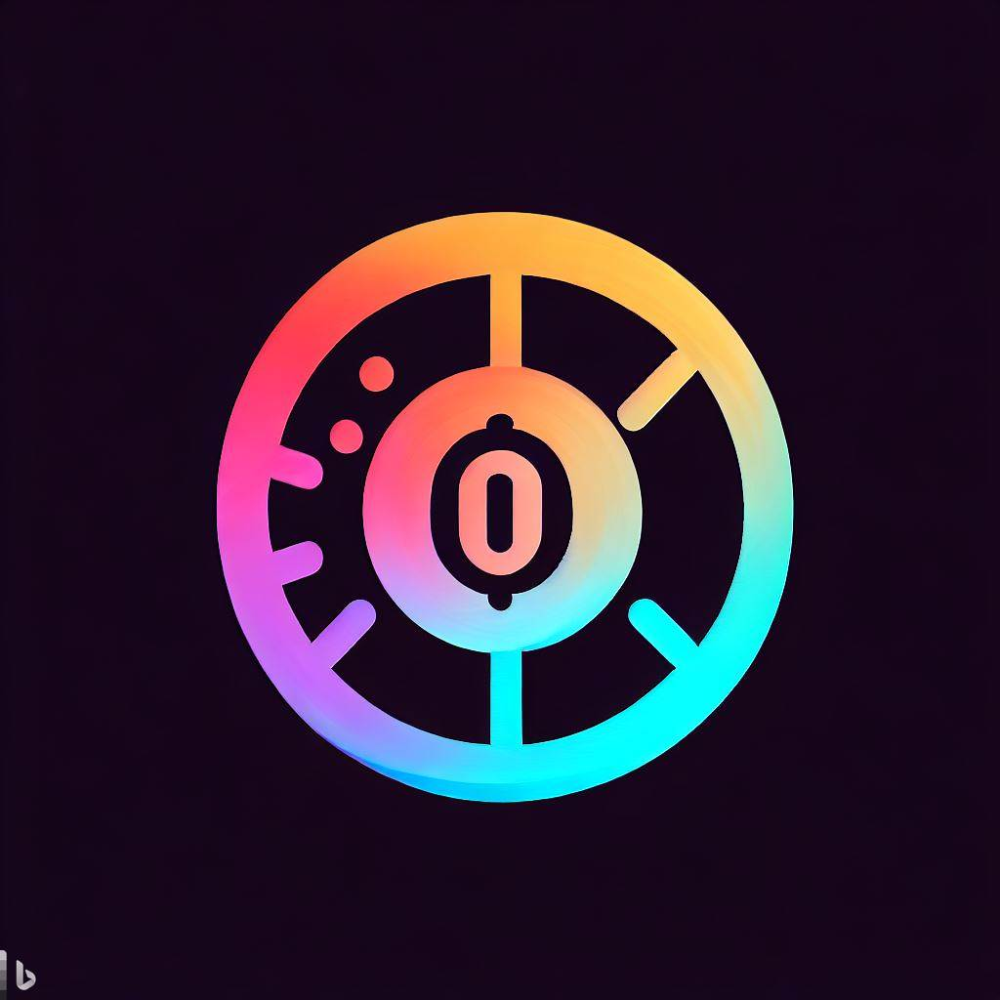

# PasswordGenerator

  

 

This application that allows you to generate secure and personalized passwords, randomly.

## Functionalities:

* You can select the length of the password to generate.
* You can select the type of password you want to generate simply by using uppercase and lowercase letters or if you prefer something more complex by adding numbers and symbols

## About

This is a project with the aim of experimenting and learning, suggestions are appreciated.
